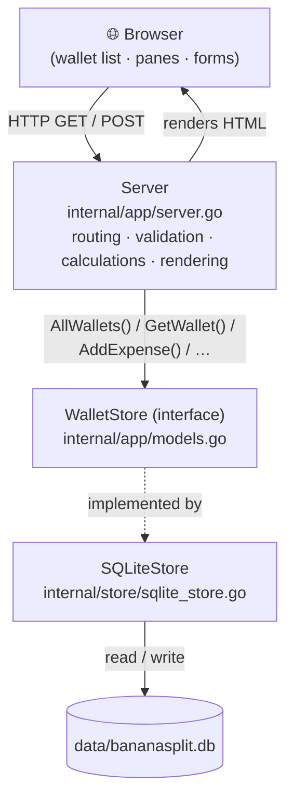

# 🍌 BananaSplit

**BananaSplit** is a tiny, self-hosted web app for tracking a **shared household
budget**. You create a wallet, add the people who share it, set how much each
one plans to contribute, and log expenses. For any period — a day, a month, or a
year — BananaSplit shows you the total spent, what's paid, what's still pending,
and how the wallet's balance is doing.

It is written in pure **Go** using the standard library for everything web-facing
(no frameworks, no router), with a small server-rendered HTML/CSS front end. Data
is stored in a single **SQLite** file through the pure-Go `modernc.org/sqlite`
driver, so there is no database server to install and no CGO/gcc toolchain
needed.

---

## Table of contents

1. [What it does](#what-it-does)
2. [The core idea: contributions vs. expenses](#the-core-idea-contributions-vs-expenses)
3. [Panes: organising a wallet by period](#panes-organising-a-wallet-by-period)
4. [Project structure](#project-structure)
5. [Architecture: how the pieces fit together](#architecture-how-the-pieces-fit-together)
6. [The request lifecycle, step by step](#the-request-lifecycle-step-by-step)
7. [Key design decisions (and *why* they work)](#key-design-decisions-and-why-they-work)
8. [Running the app](#running-the-app)
9. [Data & storage](#data--storage)
10. [Customising the logo](#customising-the-logo)
11. [Possible next steps](#possible-next-steps)

---

## What it does

- **Manage multiple wallets.** The home page lists every wallet you've created so
  you can jump back in and keep working — or delete one you no longer need. If
  there are none yet, it offers to create your first.
- **Create a wallet** with a name, the people who share it, and how it should be
  **organised**: by **day**, **month**, or **year**. You also pick the starting
  period (or leave it blank to start today).
- **Organise everything into panes.** Each period (day / month / year) is a pane,
  like a spreadsheet tab. Selecting a pane shows *only that period's* expenses and
  totals. You can add and delete panes freely.
- **Fund the wallet.** For each person you record a monthly income and a
  contribution percentage; their target is `income × percent`. The sum is the
  wallet's **planned contribution**.
- **Add expenses** — description, amount, category (with autocomplete from
  categories you've used before), who paid, and the date. An expense belongs to
  the pane its date falls in.
- **Track payment status.** New expenses start as *not paid*; mark them paid when
  the money actually moves, or remove them.
- **Read the summary** for the selected pane: available balance, planned
  contributions, paid expenses, amount awaiting payment, and the average spend per
  period.
- **See average spend by category** across every period tracked (e.g. Housing
  6 000 €/month, Supermarket 400 €/month).

The UI and code are in English.

---

## The core idea: contributions vs. expenses

BananaSplit is **not** a "who owes whom" splitter. It models a **shared pot** that
the participants fund, and against which the household's expenses are paid. Two
numbers drive everything:

> **Planned contribution** — how much the wallet is *meant* to receive, derived
> from each person's income and their chosen contribution percentage.
>
> **Available balance** — the planned contribution minus the expenses already
> marked as paid.

For each person:

```
target = SalaryCents × ContributionPercent / 100
```

and for the wallet as a whole, for the selected pane:

```
PlannedContribution = Σ each person's target
PaidExpenses        = Σ paid expenses in this period
Balance             = PlannedContribution − PaidExpenses
Outstanding         = TotalExpenses − PaidExpenses
```

### A worked example

Wallet **House**, organised **monthly**, shared by Ana and Luigi:

| Person | Monthly income | Contribution % | Target   |
| ------ | -------------- | -------------- | -------- |
| Ana    | 1 500,00 €     | 30 %           | 450,00 € |
| Luigi  | 2 000,00 €     | 40 %           | 800,00 € |

So the **planned contribution** is `450 + 800 = 1 250,00 €` per month.

Now, in **July** the wallet records:

| Expense   | Amount   | Status   |
| --------- | -------- | -------- |
| Rent      | 850,00 € | Paid     |
| Groceries | 200,00 € | Not paid |

- **Paid expenses** = 850,00 €
- **Awaiting payment** = 200,00 €
- **Available balance** = 1 250 − 850 = **400,00 €**

This calculation lives in the `summarize` function in
[internal/app/server.go](internal/app/server.go):

```go
for _, person := range wallet.People {
    summary.PlannedContributionCents += person.SalaryCents * person.ContributionPercent / 100
}
// ... accumulate this period's paid/total ...
summary.BalanceCents = summary.PlannedContributionCents - summary.PaidExpensesCents
```

### Average spend by category

Alongside the balance, `summarize` groups every expense by category and divides
each category's total by the number of periods tracked, so you get a typical
per-period figure. The overall average and the per-category averages use the same
denominator, so the categories always add back up to the overall average.

---

## Panes: organising a wallet by period

Every wallet has a **period type** — `daily`, `monthly`, or `yearly` — chosen at
creation and fixed thereafter. That granularity decides how the wallet is sliced
into **panes** and how period keys are formatted:

| Period type | Key format   | Example        | Pane label     |
| ----------- | ------------ | -------------- | -------------- |
| `daily`     | `2006-01-02` | `2026-07-14`   | 14 Jul 2026    |
| `monthly`   | `2006-01`    | `2026-07`      | July 2026      |
| `yearly`    | `2006`       | `2026`         | 2026           |

An expense is **not** stored against a pane directly; instead it carries a full
date, and its pane is derived on the fly with `periodKeyOf(expense.Date,
wallet.PeriodType)`. Switching panes simply re-filters the same expenses by that
key, which is why each pane shows only its own period.

Deleting a pane removes it **and** the expenses inside it (a prefix match on the
stored date). Deleting the last pane is allowed — the wallet then shows an empty
state inviting you to add a period, rather than silently re-creating one.

The period helpers (`periodKeyLayout`, `periodKeyOf`, `validPeriodKey`,
`periodLabel`, `periodAdverb`, `periodUnitNoun`) all live in
[internal/app/server.go](internal/app/server.go), and the last three are also
registered as template helpers so the HTML can render period-aware labels.

---

## Project structure

```
BS/
├── go.mod / go.sum              # module: bananasplit, Go 1.26, dep: modernc.org/sqlite
├── cmd/
│   └── bananasplit/
│       └── main.go              # entry point: wires the SQLite store + server, listens on :8080
├── internal/
│   ├── app/
│   │   ├── models.go            # domain types + the WalletStore contract
│   │   └── server.go            # HTTP server, routes, handlers, business logic, helpers
│   └── store/
│       └── sqlite_store.go      # SQLite implementation of WalletStore
└── web/
    ├── static/
    │   ├── styles.css           # styling
    │   └── logo.svg             # app logo (swap this file for your own)
    └── templates/
        ├── index.html           # home: wallet list, or the create/join choice
        ├── new_wallet.html      # the create-a-wallet form
        └── wallet.html          # a wallet's dashboard: panes, summary, expenses, reports
```

The `internal/` folder is a Go convention: packages under it can **only** be
imported by code inside this module. It keeps the app's internals private and
prevents accidental external dependencies.

---

## Architecture: how the pieces fit together

BananaSplit follows a clean, layered design. Each layer has one job and talks to
the next through a small, well-defined interface.



### The three layers

1. **The data model** — [internal/app/models.go](internal/app/models.go)
   Defines the domain types (`Wallet`, `Person`, `Expense`, `Period`,
   `Contribution`, `Funding`, `WalletSummary`, `CategoryAverage`) and — most
   importantly — the `WalletStore` **interface**:

   ```go
   type WalletStore interface {
       // Wallets
       AllWallets() ([]Wallet, error)
       GetWallet(id int64) (Wallet, error)
       AddWallet(name, periodType string) (Wallet, error)
       DeleteWallet(id int64) error

       // Periods
       AddPeriod(walletID int64, periodKey string) error
       DeletePeriod(walletID int64, periodKey string) error

       // People
       AddPerson(walletID int64, name string) error
       DeletePerson(walletID, personID int64) error
       FundWallet(walletID int64, funding []Funding) error

       // Expenses
       AddExpense(walletID int64, expense Expense) error
       MarkExpensePaid(walletID, expenseID int64) error
       DeleteExpense(walletID, expenseID int64) error
   }
   ```

   This interface is the **contract** between the web layer and storage. The
   server only knows *what* it can do with wallets — it does **not** know or care
   whether they live in SQLite, another database, or memory.

2. **The web/application layer** — [internal/app/server.go](internal/app/server.go)
   Owns everything HTTP-related: the routes, form parsing, input validation, the
   money and period math, and rendering HTML templates. It depends on the
   `WalletStore` *interface*, never on a concrete storage type.

3. **The storage layer** — [internal/store/sqlite_store.go](internal/store/sqlite_store.go)
   A concrete `SQLiteStore` that *implements* `WalletStore` by reading and writing
   an SQLite database on disk.

**Why this matters:** because the server depends on an interface, you could swap
SQLite for Postgres, or a fake in-memory store for tests, **without changing a
single line of the server code**. This is the classic *dependency inversion*
principle.

---

## The request lifecycle, step by step

The routes are declared in `Server.Routes()` using Go 1.22+ **method-based
routing patterns**, so method *and* path (including `{id}` wildcards) are matched
with no external router:

```go
mux.Handle("GET /static/", http.StripPrefix("/static/", http.FileServer(http.Dir("web/static"))))

// Home + wallets
mux.HandleFunc("GET /",                          s.handleIndex)
mux.HandleFunc("GET /wallets/new",               s.handleNewWallet)
mux.HandleFunc("POST /wallets",                  s.handleCreateWallet)
mux.HandleFunc("POST /wallets/delete",           s.handleDeleteWallet)
mux.HandleFunc("GET /wallets/{id}",              s.handleWallet)

// Periods (panes)
mux.HandleFunc("POST /wallets/{id}/periods",         s.handleAddPeriod)
mux.HandleFunc("POST /wallets/{id}/periods/delete",  s.handleDeletePeriod)

// People & funding
mux.HandleFunc("POST /wallets/{id}/people",          s.handleAddPerson)
mux.HandleFunc("POST /wallets/{id}/people/delete",   s.handleDeletePerson)
mux.HandleFunc("POST /wallets/{id}/fund",            s.handleFundWallet)

// Expenses
mux.HandleFunc("POST /wallets/{id}/expenses",                 s.handleAddExpense)
mux.HandleFunc("POST /wallets/{id}/expenses/{expenseID}/paid", s.handleMarkExpensePaid)
mux.HandleFunc("POST /wallets/{id}/expenses/delete",          s.handleDeleteExpense)
```

The whole mux is wrapped in a small `noCache` middleware (see the design notes
below).

### 1. The home page — `GET /`

`handleIndex` loads every wallet via `store.AllWallets()`. If any exist, the
template lists them as links (each with a delete button); if not, it shows the
"Create a new wallet" / "Join an existing wallet (coming soon)" choice.

### 2. Creating a wallet — `POST /wallets`

`handleCreateWallet` validates the name and at least one participant, reads the
chosen period type and starting period (`readPeriodKey`, defaulting to the current
period if left blank), then creates the wallet, its people, and the first pane,
and redirects to it.

### 3. Viewing a wallet — `GET /wallets/{id}`

`handleWallet` loads the wallet, picks the selected pane from `?period=…` (falling
back to the newest, or an empty state if the wallet has no panes), runs
`summarize` for that pane, splits the period's expenses into paid/unpaid, and
gathers the distinct categories used (for the autocomplete). Then it renders
`wallet.html`.

### 4. Panes, people, funding, expenses

`handleAddPeriod` / `handleDeletePeriod` add or remove a pane;
`handleAddPerson` / `handleDeletePerson` manage participants; `handleFundWallet`
saves each person's income and contribution percentage; and the expense handlers
add an expense (validating its date falls inside the selected pane), mark one as
paid, or delete one.

### Why redirect after every write? (POST/Redirect/GET)

Every write finishes with an HTTP **303 See Other** redirect instead of rendering
HTML directly. This is the **Post/Redirect/Get** pattern: the browser's final page
is a plain `GET`, so refreshing or hitting "back" won't re-submit a form and
accidentally repeat an action. Validation failures redirect back with an
`?error=…` message that the template shows in a banner.

---

## Key design decisions (and *why* they work)

### Money is stored as integer **cents**, never floats

Every amount lives in an `int64` of cents. Floating-point numbers can't represent
values like `0.10` exactly, which causes rounding drift when you sum many
expenses. Whole cents make all arithmetic **exact**.

- `parseMoney` converts user text (`"42,50"` or `"42.50"`) into `4250` cents. It
  accepts both comma and dot decimals and rejects malformed input.
- `formatMoney` converts back for display: `4250 → "42,50 €"`.

### A period is a *derived* key, not stored per expense

Expenses carry a real date; their pane is computed with `periodKeyOf`. This keeps
the schema simple (no denormalised "month" column on each expense to keep in sync)
and lets the same expense list power any granularity through one filter.

### Templates are parsed once, at startup

In `NewServer`, all templates are parsed a single time and stored on the `Server`
struct, and the custom helpers (`money`, `moneyInput`, `contribution`, `percent`,
`periodLabel`, `periodAdverb`, `periodUnitNoun`, `date`, `assetVersion`) are
registered. Parsing once is faster than per-request and catches template errors
immediately on boot.

### Auto-escaped HTML by default

The server uses Go's `html/template` (not `text/template`). Every value inserted
into the page — wallet names, descriptions, categories — is automatically
**HTML-escaped**, protecting against cross-site scripting (XSS) from user input,
for free.

### SQLite with cascading deletes, no CGO

`SQLiteStore` uses the pure-Go `modernc.org/sqlite` driver, so it builds without a
C toolchain. It enables `PRAGMA foreign_keys = ON` and declares `ON DELETE
CASCADE` on every child table, so deleting a wallet automatically removes its
periods, people, and expenses. The schema is created on first run
(`CREATE TABLE IF NOT EXISTS …`), and missing columns from older databases are
backfilled with a small `addColumnIfMissing` helper — so upgrades "just work".

### Fresh assets: `no-cache` + versioned URLs

Two small measures keep browsers from showing stale CSS or pages:

- The `noCache` middleware sets `Cache-Control: no-cache` on every response, so
  the browser always revalidates (switching panes always reflects the right
  period).
- The stylesheet link carries `?v={{assetVersion "styles.css"}}` — the file's
  modification time — so a changed CSS file is re-fetched even by browsers holding
  a cached copy.

### Cross-browser form controls

The CSS strips the native `appearance` from inputs, selects, and buttons (keeping
radios/checkboxes native) and draws its own dropdown chevron, so Safari/WebKit
renders the same styled controls as Chromium instead of its native chrome. The
month picker is a plain English month-name `<select>` + a year field rather than
`<input type="month">`, whose placeholder text follows the browser's locale and
can't be forced to English.

---

## Running the app

The entry point already exists at
[cmd/bananasplit/main.go](cmd/bananasplit/main.go). It creates the SQLite store,
injects it into the server, and starts listening on `:8080`.

Run it **from the project root** — this matters, because the server loads
`web/templates/*.html` and `web/static/` using relative paths:

```bash
cd BS
go run ./cmd/bananasplit
```

Open <http://localhost:8080> in your browser.

To build a standalone binary instead:

```bash
go build -o bananasplit ./cmd/bananasplit
./bananasplit
```

You can override the port by editing `addr` in `main.go` (it is currently the
fixed string `":8080"`).

---

## Data & storage

All data is persisted to a single SQLite database at `data/bananasplit.db`. The
`data/` folder and `*.db` files are git-ignored, and the database and its schema
are created automatically on first run.

The schema (in [internal/store/sqlite_store.go](internal/store/sqlite_store.go)):

| Table           | Holds                                                                 |
| --------------- | --------------------------------------------------------------------- |
| `wallets`       | `id`, `name`, `period_type`                                           |
| `budget_months` | one row per pane: `wallet_id`, `month` (a period key of any grain)    |
| `people`        | `id`, `wallet_id`, `name`, `salary_cents`, `contribution_percent`     |
| `expenses`      | `id`, `wallet_id`, `description`, `category`, `paid_by_id`, `amount_cents`, `date`, `is_paid` |
| `contributions` | `id`, `wallet_id`, `person_id`, `amount_cents`, `date` — reserved for a future per-contribution ledger; loaded into the model but not yet written |

> Note: the panes table is physically named `budget_months` (and its column
> `month`) for backwards compatibility, but it stores period keys of **any**
> granularity — a daily wallet keeps `2026-07-14` there, a yearly one keeps
> `2026`.

---

## Customising the logo

The logo shown in the header and on the landing page is a single image file:
[web/static/logo.svg](web/static/logo.svg). To use your own, **replace that file**
with your artwork, keeping the same name — it appears everywhere immediately, and
the versioned URL means you won't have to clear your cache.

- Prefer an SVG or a roughly **square** image; it's rendered in small rounded
  boxes (38 px in the header, 52 px on the landing page).
- Using a PNG/JPG instead? Save it as e.g. `web/static/logo.png` and change the
  `src` from `logo.svg` to `logo.png` in the three templates
  ([index.html](web/templates/index.html), [wallet.html](web/templates/wallet.html),
  [new_wallet.html](web/templates/new_wallet.html)).

---

## Possible next steps

- **"Join an existing wallet"** — currently a placeholder. This would need user
  accounts / sharing, which the single-file local setup doesn't have yet.
- **A real contributions ledger** — record actual money paid *into* the wallet
  over time (the `contributions` table is already there), instead of only a
  planned target.
- **Editing** — expenses and people can be added and deleted, but not edited in
  place.
- **Category normalisation** — `Housing` and `housing` currently count as
  distinct categories.
- **Tests** — unit tests for `parseMoney`, `summarize`, the period helpers, and a
  fake `WalletStore`.
- **Auth & deployment** — the app has no authentication and is meant to run
  locally; putting it on a network would need both.

---

_Built with Go and its standard library, plus a pure-Go SQLite driver. No web
frameworks, no database server, no fuss._ 🍌
