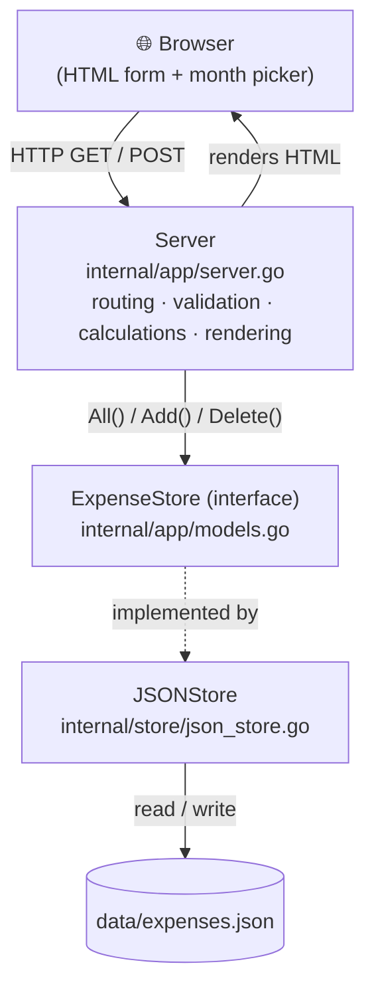

# 🍌 BananaSplit

**BananaSplit** is a tiny, self-hosted web app that helps two people track and
split their shared monthly expenses **50 / 50**. You log who paid for what, and
BananaSplit tells you — for any given month — the total spent, how much each
person paid, and **who owes whom** to make things even again.

It is written in pure **Go** using only the standard library (no external
frameworks), with a small HTML/CSS front end. Data is stored in a plain JSON
file, so there is no database to install.

---

## Table of contents

1. [What it does](#what-it-does)
2. [The core idea: how the split works](#the-core-idea-how-the-split-works)
3. [Project structure](#project-structure)
4. [Architecture: how the pieces fit together](#architecture-how-the-pieces-fit-together)
5. [The request lifecycle, step by step](#the-request-lifecycle-step-by-step)
6. [Key design decisions (and *why* they work)](#key-design-decisions-and-why-they-work)
7. [Running the app](#running-the-app)
8. [Data format](#data-format)
9. [Possible next steps](#possible-next-steps)

---

## What it does

- Add an expense: description, amount, category, who paid, and the date.
- Browse expenses **one month at a time** using a month picker.
- See a live **monthly summary**:
  - Total spent that month.
  - How much **User A** paid.
  - How much **User B** paid.
  - A **settlement** line: who should pay whom, and how much, to be even.
- Delete an expense you added by mistake.

The UI and code are in English.

---

## The core idea: how the split works

Everything BananaSplit does revolves around one simple rule:

> Every shared expense belongs **equally** to both people, no matter who
> actually paid for it.

So for a given month:

1. **Total** = sum of every expense that month.
2. Each person's **fair share** = half of the total.
3. Each person's **balance** = _(what they actually paid)_ − _(their fair share)_.
   - A **positive** balance means they overpaid → they are owed money.
   - A **negative** balance means they underpaid → they owe money.
4. The **settlement** is simply the size of that imbalance.

### A worked example

Suppose in one month:

| Expense       | Paid by  | Amount  |
| ------------- | -------- | ------- |
| Supermarket   | User A   | 60,00 € |
| Restaurant    | User B   | 40,00 € |

- **Total** = 100,00 €
- **Each fair share** = 50,00 €
- **User A's balance** = 60 − 50 = **+10,00 €** (overpaid)
- **User B's balance** = 40 − 50 = **−10,00 €** (underpaid)

So the settlement is: **"User B should pay User A 10,00 €"**, and both end up
having contributed 50,00 € each.

This exact calculation lives in the `summarize` function in
[internal/app/server.go](internal/app/server.go):

```go
summary.UserAShareCents = summary.TotalCents / 2
summary.UserBShareCents = summary.TotalCents - summary.UserAShareCents

userABalance := summary.UserAPaidCents - summary.UserAShareCents
summary.SettlementCents = abs(userABalance)
```

Notice that User B's share is computed as `Total − User A's share` rather
than a second division. **Why?** Integer division can drop a cent (e.g. an odd
total like 100,01 €). By giving one half the floored value and the other half
*the remainder*, the two shares **always add back up to the exact total** — no
lost cent.

---

## Project structure

```
BananaSplit/
├── go.mod                       # Module definition (module: bananasplit, Go 1.26)
├── internal/
│   ├── app/
│   │   ├── models.go            # Core data types + the ExpenseStore contract
│   │   └── server.go            # HTTP server, routes, handlers, business logic
│   └── store/
│       └── json_store.go        # JSON-file implementation of ExpenseStore
└── web/
    ├── static/
    │   └── styles.css           # Styling
    └── templates/
        └── index.html           # The single-page HTML template
```

The `internal/` folder is a Go convention: packages under it can **only** be
imported by code inside this module. It keeps the app's internals private and
prevents accidental external dependencies.

---

## Architecture: how the pieces fit together

BananaSplit follows a clean, layered design. Each layer has one job and talks to
the next through a small, well-defined interface.



### The three layers

1. **The data model** — [internal/app/models.go](internal/app/models.go)
   Defines what an `Expense` is, what a `MonthlySummary` looks like, and — most
   importantly — the `ExpenseStore` **interface**:

   ```go
   type ExpenseStore interface {
       All() ([]Expense, error)
       Add(expense Expense) (Expense, error)
       Delete(id int64) error
   }
   ```

   This interface is the **contract** between the web layer and storage. The
   server only knows "I can list, add, and delete expenses" — it does **not**
   know or care whether they live in a JSON file, a database, or memory.

2. **The web/application layer** — [internal/app/server.go](internal/app/server.go)
   Owns everything HTTP-related: the routes, form parsing, input validation, the
   money math, and rendering HTML templates. It depends on the
   `ExpenseStore` *interface*, never on a concrete storage type.

3. **The storage layer** — [internal/store/json_store.go](internal/store/json_store.go)
   A concrete `JSONStore` that *implements* `ExpenseStore` by reading and writing
   a JSON file on disk.

**Why this matters:** because the server depends on an interface, you could swap
the JSON store for a SQLite or Postgres store **without changing a single line
of the server code**. This is the classic *dependency inversion* principle, and
it also makes the code easy to unit-test with a fake store.

---

## The request lifecycle, step by step

The routes are declared in `Server.Routes()`:

```go
mux.Handle("GET /static/", http.StripPrefix("/static/", http.FileServer(http.Dir("web/static"))))
mux.HandleFunc("GET /",                s.handleIndex)
mux.HandleFunc("POST /expenses",       s.handleCreateExpense)
mux.HandleFunc("POST /expenses/delete", s.handleDeleteExpense)
```

(These use Go 1.22+ **method-based routing patterns**, so `GET /` and
`POST /expenses` are matched by both method *and* path — no external router
needed.)

### 1. Viewing a month — `GET /`

Handled by `handleIndex`:

1. Read the `month` query parameter (e.g. `?month=2026-07`). If missing, default
   to the current month via `time.Now().Format("2006-01")`.
2. Load **all** expenses from the store.
3. Keep only the ones in the selected month (`filterByMonth`).
4. Build the `MonthlySummary` (`summarize`) — this is where the split math runs.
5. Render `index.html` with the expenses, the summary, and the selected month.

### 2. Adding an expense — `POST /expenses`

Handled by `handleCreateExpense`, which is careful about validation:

1. Parse the submitted form.
2. Convert the amount from text to integer cents with `parseMoney` — rejects
   empty, non-numeric, negative, or over-precise values.
3. Parse the date (`2006-01-02` format).
4. Trim the description; reject it if empty.
5. Default the category to `"General"` if left blank.
6. Ensure `paid_by` is exactly `"User A"` or `"User B"`.
7. Save via `store.Add(...)`.
8. **Redirect** to `/?month=...` for the expense's month.

If any check fails, the handler calls `redirectWithError`, which bounces back to
the index page with an `?error=...` message that the template shows in a banner.

### 3. Deleting an expense — `POST /expenses/delete`

Handled by `handleDeleteExpense`: parse the hidden `id`, call `store.Delete(id)`,
then redirect back to the month you were viewing.

### Why redirect after every write? (POST/Redirect/GET)

Both create and delete finish with an HTTP **303 See Other** redirect instead of
rendering HTML directly. This is the **Post/Redirect/Get** pattern. It means the
browser's final page is a plain `GET`, so refreshing or hitting "back" won't
re-submit the form and accidentally add or delete the same expense twice.

---

## Key design decisions (and *why* they work)

### Money is stored as integer **cents**, never floats

Every amount lives in `AmountCents int64`. Floating-point numbers can't
represent values like `0.10` exactly, which leads to rounding drift when you sum
many expenses. Using whole cents makes all arithmetic **exact**.

- `parseMoney` converts user text (`"42,50"` or `"42.50"`) into `4250` cents. It
  accepts both comma and dot decimals, and rejects malformed input.
- `formatMoney` converts back for display: `4250 → "42,50 €"`.

### Templates are parsed once, at startup

In `NewServer`, all templates are parsed a single time and stored on the
`Server` struct. Custom template helpers (`money` and `date`) are registered so
the HTML can format values cleanly:

```go
template.New("").Funcs(template.FuncMap{
    "money": formatMoney,
    "date":  formatDate,
}).ParseGlob("web/templates/*.html")
```

Parsing once (instead of per request) is faster and catches template errors
immediately on boot.

### Auto-escaped HTML by default

The server uses Go's `html/template` (not `text/template`). Every value
inserted into the page — descriptions, categories — is automatically
**HTML-escaped**, which protects against cross-site scripting (XSS) from
user-typed input, for free.

### Concurrency-safe storage

`JSONStore` guards every operation with a `sync.Mutex`:

```go
func (s *JSONStore) Add(expense app.Expense) (app.Expense, error) {
    s.mu.Lock()
    defer s.mu.Unlock()
    // ... load, append, save
}
```

A web server handles requests concurrently, so two people could add an expense
at the same instant. The mutex ensures the read-modify-write cycle on the JSON
file happens **one at a time**, preventing corrupted or lost data.

### Self-initializing store

`NewJSONStore` creates the parent directory (`os.MkdirAll`) and seeds an empty
`[]` file if none exists. So the app "just works" on first run — there is no
setup script and nothing to migrate.

### Sequential IDs

`nextID` finds the current highest ID and returns `max + 1`. Simple, predictable,
and good enough for a small single-file store.

---

## Running the app

> **Note:** The repository currently contains the reusable packages
> (`internal/app` and `internal/store`) and the web assets, but **not** a
> `main.go` entry point that starts the server. The two packages are designed to
> be wired together in just a few lines.

Create a file at `cmd/bananasplit/main.go`:

```go
package main

import (
    "log"
    "net/http"

    "bananasplit/internal/app"
    "bananasplit/internal/store"
)

func main() {
    // 1. Create the storage layer (JSON file on disk).
    jsonStore, err := store.NewJSONStore("data/expenses.json")
    if err != nil {
        log.Fatalf("could not create store: %v", err)
    }

    // 2. Create the server, injecting the store (dependency injection).
    server, err := app.NewServer(jsonStore)
    if err != nil {
        log.Fatalf("could not create server: %v", err)
    }

    // 3. Start listening.
    addr := ":8080"
    log.Printf("BananaSplit listening on http://localhost%s", addr)
    if err := http.ListenAndServe(addr, server.Routes()); err != nil {
        log.Fatal(err)
    }
}
```

Then run it **from the project root** (this matters — the server loads
`web/templates/*.html` and `web/static/` using relative paths):

```bash
cd BananaSplit
go run ./cmd/bananasplit
```

Open <http://localhost:8080> in your browser.

To build a standalone binary instead:

```bash
go build -o bananasplit ./cmd/bananasplit
./bananasplit
```

---

## Data format

Expenses are persisted to `data/expenses.json` (the `data/` folder is
git-ignored). Each record looks like this:

```json
[
  {
    "id": 1,
    "description": "Supermarket",
    "category": "Food",
    "paid_by": "User A",
    "amount_cents": 6000,
    "date": "2026-07-04T00:00:00Z"
  }
]
```

Because it's plain, indented JSON, you can inspect or hand-edit it in any text
editor — handy for debugging or backups.

---

## Possible next steps

- Add the `cmd/bananasplit/main.go` entry point described above.
- Make the two names (`User A` / `User B`) configurable instead of hard-coded.
- Support arbitrary split ratios (e.g. 60/40) instead of a fixed 50/50.
- Add per-category breakdowns to the monthly summary.
- Swap `JSONStore` for a SQLite store — thanks to the `ExpenseStore` interface,
  the server code won't need to change.
- Add unit tests for `parseMoney`, `summarize`, and a fake `ExpenseStore`.

---

_Built with Go and its standard library. No frameworks, no database, no fuss._ 🍌
